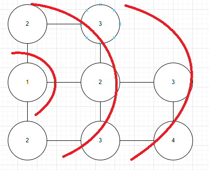

# Graphs
In maths we can say that a graph is a group of vertex and edges "G = (V, E)".

Example of a graph with V = 3 and E = 5: 


- - -

## Types of Graphs depending on its direction

### **Directed:**
The Edges only travels in one direction.

Ex: We can see that A is connected with C but C is not connected to A.


### **Undirected or Bidirectional:**
The Edges can travel in both directions.

Ex: We can see that A is connected with C and C is connected with A.


Also it can be represented without the arrows.


- - -

## Representation

### **Adjacency list**
Very usefull for graphs with much more vertex than edges.

The sum of the elements in the list depends if the graph is undirected or directed, if the graph is directed the number of elements it is equal to the edges, if the graph is undirected it is the double of the egdes.

Example:


### **Adjacency matrix**
Very usefull for obtain, by a fast way, the conectivity between two nodes.

This is very fast because if you access the position `[i][j]` in the matrix and the value is 1, the nodes are connected and it represents a constant time `0(1)`.

The formula is `m[i][j] == 1`, they are connected!

Example:


- - -

## **BFS** Algorithm

* We start at one node
* We search all the nodes that are directly connected with the starting node
* We stand up in a connected node and search the other connected nodes
* We repeat it until complete the graph

With this algorithm we can know the distance between the starter node and the rest of nodes.

Example:



Code in Java:

``` Java
public static void BFS (Graph graph, int node) {
    // Create a queue
    Queue<Integer> queue = new ArrayDeque<>();

    // Create a visited nodes array
    boolean[] visited = new boolean[graph.length];

    // Marks the node as visited
    visited[node] = true;

    // Adds the node to the queue
    queue.add(node);

    // While until the queue is empty
    while (!queue.isEmpty()) {
        // Take off the node of the queue
        node = queue.poll();
        System.out.print(node + " ");

        // Do it for every connected
        for (int n : graph.adjList.get(node)) {
            if (!visited[n]) {
                // Marks as visited and take it to the queue
                visited[n] = true;
                queue.add(n);
            }
        }
    }
}
```

Code in .NET

``` C#
public static void BFS(Graph graph, int node) {
    Queue<int> queue = new Queue<int>();
    bool[] visited = new bool[graph.length];

    visited[node] = true;
    queue.Enqueue(node);

    while(queue.Count > 0) {
        node = queue.Dequeue();
        Console.WriteLine(node + " ");

        foreach (int n in graph.adjList.Find(node)) {
            if (!visited[n]) {
                visited[n] = true
                queue.Enqueue(n);
            }
        }
    }
}
```